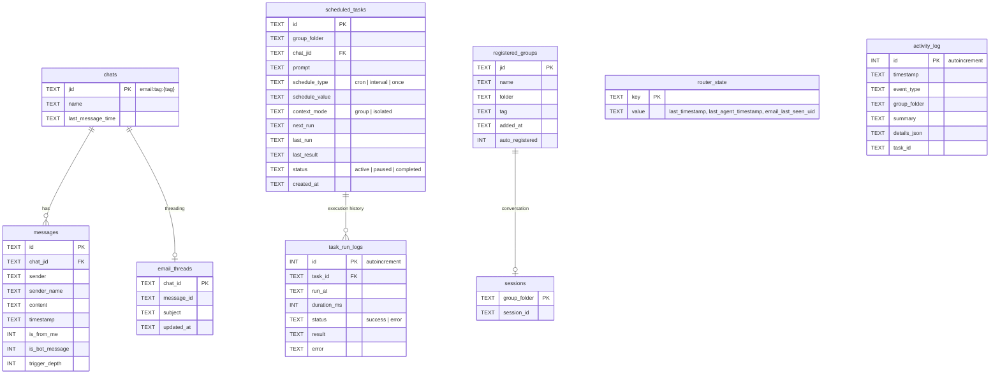

# NanoClaw Architecture

A single Node.js process that orchestrates a network of AI agents via self-to-self email routing, local Ollama models, and file-based IPC.

---

## System Overview


---

## Multi-Agent Network

Each agent is an isolated OpenCode subprocess with its own group folder, persona (`CLAUDE.md`), and conversation session. Agents communicate exclusively through self-to-self trigger emails.


### Group Folder Structure

```
groups/
├── global/
│   └── CLAUDE.md          # Shared instructions for ALL agents
├── main/                  # Admin agent (MAIN_TAG)
│   ├── CLAUDE.md          # Admin persona + elevated privileges
│   └── logs/              # Agent execution logs
├── research/
│   ├── CLAUDE.md          # Research persona
│   └── logs/
├── content/
│   ├── CLAUDE.md
│   └── logs/
├── ...                    # product, growth, ops, community, social, family
```

### Agent Privileges

| Capability | Admin (`main`) | Other Groups |
|---|---|---|
| Trigger any group's tag | Yes | No (own tag only) |
| Schedule tasks for other groups | Yes (`target_chat_id`) | No |
| View all scheduled tasks | Yes | Own group only |
| Auto-registered | No (pre-configured) | Yes (on first email) |

---

## Message Flow

Complete lifecycle of an inbound email through the system:


---

## Task Scheduling & Management


### Schedule Types

| Type | `schedule_value` | Example | Behavior |
|---|---|---|---|
| `cron` | Cron expression | `0 9 * * *` | Runs daily at 9am, recalculates `next_run` |
| `interval` | Milliseconds | `3600000` | Runs every hour from `next_run` |
| `once` | ISO timestamp | `2026-03-01T10:00:00` | Runs once, then `status='completed'` |

### Context Modes

| Mode | Behavior |
|---|---|
| `group` | Resumes existing OpenCode session (conversation history preserved) |
| `isolated` | Fresh session per run (no history, all context must be in prompt) |

---

## IPC (Inter-Process Communication)

File-based communication between the host process and agent subprocesses:


### IPC File Types

| `type` | Direction | Purpose |
|---|---|---|
| `message` | Agent → Host | Send a message to the user mid-execution |
| `trigger_email` | Agent → Host | Trigger work in another group |
| `schedule_task` | Agent → Host | Create a scheduled task |
| `pause_task` | Agent → Host | Pause a scheduled task |
| `resume_task` | Agent → Host | Resume a paused task |
| `cancel_task` | Agent → Host | Delete a scheduled task |

---

## Trigger System & Loop Protection


### Rate Limiting

| Mechanism | Config | Default | Scope |
|---|---|---|---|
| Trigger depth | `MAX_TRIGGER_DEPTH` | 3 | Per chain |
| Cooldown | `TRIGGER_COOLDOWN_MS` | 30s | Per source→target pair |
| Hourly limit | `MAX_TRIGGERS_PER_HOUR` | 120 | Global (all agents) |

---

## Concurrency Model (GroupQueue)


### Drain Priority

1. **Pending tasks** for the same group (FIFO)
2. **Pending messages** for the same group
3. **Waiting groups** (other groups blocked by concurrency limit)

---

## Database Schema



---

## Configuration & Environment


### OpenCode Configuration

`opencode.json` registers the MCP server so each agent subprocess can call NanoClaw tools:

```json
{
  "mcp": {
    "nanoclaw": {
      "type": "local",
      "command": ["node", "../../dist/mcp-server.js"]
    }
  }
}
```

Environment variables passed to each agent subprocess:

| Variable | Purpose |
|---|---|
| `NANOCLAW_CHAT_ID` | Target chat ID for this invocation |
| `NANOCLAW_GROUP_FOLDER` | Group folder name (e.g., `research`) |
| `NANOCLAW_IS_MAIN` | `'1'` if admin group, else `'0'` |
| `NANOCLAW_TRIGGER_DEPTH` | Current trigger chain depth |

---

## Monitoring & Observability


### Activity Event Types

| Event | Logged When |
|---|---|
| `agent_started` | OpenCode agent spawned |
| `agent_completed` | Agent finishes successfully |
| `agent_error` | Agent fails or times out |
| `email_received` | Inbound email parsed |
| `email_sent` | Outbound response delivered |
| `trigger_email_sent` | Cross-group trigger dispatched |
| `task_scheduled_run` | Scheduled task executes |
| `task_manual_trigger` | Dashboard triggers a task |
| `ipc_message_sent` | Agent's send_message delivered |

---

## File & Directory Layout

```
nanoclawf/
├── src/
│   ├── index.ts              # Orchestrator: state, message loop, heartbeat
│   ├── channels/
│   │   └── email.ts          # IMAP polling, SMTP sending, self-trigger emails
│   ├── opencode-client.ts    # Spawns `opencode run`, parses NDJSON output
│   ├── mcp-server.ts         # MCP tool server (runs per agent subprocess)
│   ├── ipc.ts                # IPC watcher, task processing, rate limiting
│   ├── group-queue.ts        # Per-group concurrency control
│   ├── task-scheduler.ts     # Scheduled task polling and execution
│   ├── db.ts                 # SQLite schema, queries, migrations
│   ├── router.ts             # Message formatting, outbound routing
│   ├── agent-tracker.ts      # Live agent event tracking, token metrics
│   ├── monitor.ts            # HTTP dashboard server
│   ├── config.ts             # Configuration loading (.env + defaults)
│   ├── env.ts                # .env file reader
│   └── logger.ts             # Pino logger
├── groups/
│   ├── global/CLAUDE.md      # Instructions inherited by ALL agents
│   ├── main/CLAUDE.md        # Admin agent persona
│   ├── research/CLAUDE.md    # Research agent persona
│   ├── content/CLAUDE.md     # Content agent persona
│   ├── product/CLAUDE.md     # Product agent persona
│   ├── growth/CLAUDE.md      # Growth agent persona
│   ├── ops/CLAUDE.md         # Ops agent persona
│   ├── community/CLAUDE.md   # Community agent persona
│   ├── social/CLAUDE.md      # Social agent persona
│   └── family/CLAUDE.md      # Family agent persona
├── data/
│   ├── ipc/{group}/          # IPC message and task files
│   │   ├── messages/         # send_message IPC files
│   │   ├── tasks/            # trigger/schedule IPC files
│   │   └── current_tasks.json
│   ├── heartbeat.json        # System health snapshot
│   └── errors/               # Failed IPC files
├── store/
│   └── messages.db           # SQLite database
├── opencode.json             # MCP server registration for OpenCode
├── .env                      # Secrets and configuration
├── package.json
└── tsconfig.json
```
